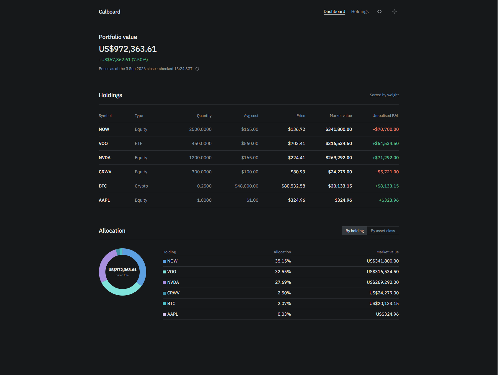
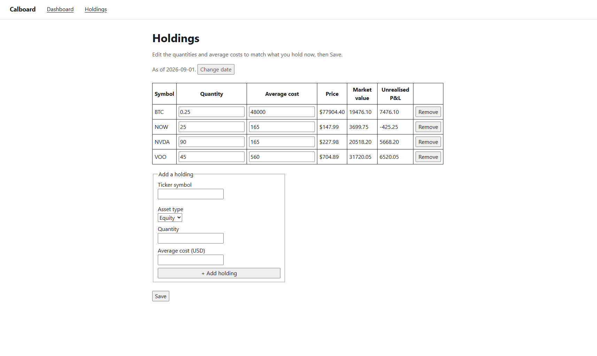

# Calboard

Calboard tracks your portfolio — value, holdings, cost basis, unrealised
gain/loss, allocation, and price freshness.

**Calboard never executes trades.** Your brokerage/trading platform is the
system of record for buying and selling; Calboard is a read-only intelligence
layer on top of it.

Local-only, single-user, never publicly deployed. Not financial advice.

## Screenshots




*Dashboard — demonstration data, not real holdings.*



*Holdings editor — demonstration data, not real holdings.*

## Setup

### Prerequisites

- [Node.js](https://nodejs.org/) 20 or later
- [Docker](https://www.docker.com/) (for local Postgres)
- npm

### 1. Install dependencies

```bash
npm install
```

Playwright's browser binary is a separate download from the `playwright`
package itself. `selfTest.test.ts` (the evidence runner's self-test) is
picked up by `npm test`'s default file glob, so without this step, both
`npm test` and `npm run evidence` fail on a fresh clone with an opaque
"Executable doesn't exist" error rather than anything mentioning Playwright:

```bash
npx playwright install chromium
```

### 2. Start Postgres

```bash
docker compose up -d
```

This starts Postgres 16 on `127.0.0.1:5432` with a `calboard` database and
`calboard` / `calboard_dev_local_only` credentials, defined in
`docker-compose.yml`. These are local dev-only defaults — the port is bound to
localhost only and is never meant to be exposed beyond your machine.

### 3. Configure environment variables

```bash
cp .env.example .env.local
```

Then edit `.env.local`:

| Variable | Required | Notes |
|---|---|---|
| `DATABASE_URL` | Yes | Points at the `calboard` database from step 2. |
| `TEST_DATABASE_URL` | Yes, to run tests | Must point at a database whose name ends in `_test` — see [Testing](#testing). |
| `MARKET_DATA_PROVIDER` | No | `YAHOO` (default) or `EODHD`. |
| `EODHD_API_KEY` | Only if `MARKET_DATA_PROVIDER=EODHD` | The default provider, Yahoo Finance, needs no key. |
| `ALPACA_API_KEY_ID`, `ALPACA_API_SECRET_KEY`, `RENDER_API_KEY` | No | Reserved for future milestones; not read by the current build. |
| `SEC_USER_AGENT` | Yes, to run the analyzer | EDGAR requires a User-Agent identifying the requester: `Product/Version (you@example.com)`. Acquisition refuses to start without it. |
| `ANALYZER_OFFLINE` | No | Set to `1` to acquire from the committed SEC captures and the recorded quotes beside them, calling nothing. Explicit offline mode, never a fallback. |
| `ANTHROPIC_API_KEY` | Only for the report's prose | Runs the §8.2 interpretation layer and the §8.5 blind challenger. Without it both calls are skipped and Sections I and I2 say so; every computed value on the report is unaffected, because §8.1 puts calculation on the other side of that boundary. |

### 4. Create the test database

The Postgres container only creates the `calboard` database from step 2.
Create a second one for integration tests, matching the name in
`TEST_DATABASE_URL`:

```bash
docker exec -i $(docker compose ps -q postgres) psql -U calboard -d calboard -c "CREATE DATABASE calboard_test;"
```

### 5. Run migrations

`npm run migrate` applies `migrations/001_portfolio_core.sql` against
whichever database `DATABASE_URL` currently points to, tracking what's been
applied in a `schema_migrations` table. Run it once for the dev database, and
once more pointed at the test database:

```bash
npm run migrate

# then, pointed at the test database. TEST_DATABASE_URL lives only inside
# .env.local (loaded by dotenv in-process) — it is not in your shell's
# environment, so it must be extracted and exported explicitly:
export DATABASE_URL=$(grep '^TEST_DATABASE_URL=' .env.local | cut -d '=' -f2-)
npm run migrate
```

```powershell
# PowerShell equivalent for the second run:
$env:DATABASE_URL = (Get-Content .env.local | Select-String '^TEST_DATABASE_URL=').Line.Split('=',2)[1]
npm run migrate
```

### 6. Run the app

```bash
npm run dev
```

Open [http://127.0.0.1:3000](http://127.0.0.1:3000).

### 7. One analyzer run from the command line

```bash
npm run ai-run -- MSFT
```

Drives one company through the same functions the routes drive — the Step 2
spot-check queue, each fact decision, the Step 6 profile confirmation, and the
gated computation — then prints the §8.2 interpretation, page one's four
variable sentences and the §8.5 challenger findings.

The last section is the point: it re-walks every figure reference in every
[C] sentence and prints the Analysis Result field it was substituted from. A
figure with no field behind it is a defect under spec §8.3 limit 3, and this
is where that claim can be read rather than taken on trust.

### Testing

```bash
npm test
```

Tests run against a real Postgres database (`TEST_DATABASE_URL`) and truncate
tables between runs. `vitest.setup.ts` refuses to run unless that database's
name ends in `_test`, so a plain `npm test` can never wipe your real
portfolio data.

## Architecture

**Modular monolith.** A single Next.js app — UI, server actions, and data
access in one codebase — backed by one PostgreSQL database. No separate
services in the current build.

- `app/` — Next.js App Router: pages, server actions, UI components
- `lib/` — domain logic (ledger, portfolio, market data, assets, accounts),
  independent of the request/response layer
- `migrations/` — hand-written, numbered SQL migrations applied in order

**`MarketDataProvider` abstraction.** Equity/ETF price and identity data is
fetched through the `MarketDataProvider` interface
(`lib/marketdata/provider.ts`), never directly against a vendor SDK. Two
adapters exist today — `yahooProvider` (default, via `yahoo-finance2`, no API
key) and `eodhdProvider` (opt-in via `MARKET_DATA_PROVIDER=EODHD`) — selected
at runtime by `lib/marketdata/index.ts`. Swapping vendors is a config change,
not a code change. Cryptocurrency identity is resolved separately, only
through a small verified registry (`lib/marketdata/cryptoSymbols.ts`), never
a bare provider ticker — see [Engineering Notes](#engineering-notes) below
for why.

**USD as the accounting source of truth.** Every ledger figure, cost basis,
and stored price is USD, enforced by the schema (`*_usd` columns throughout
`migrations/001_portfolio_core.sql`). An approximate SGD figure is specified
as a future, render-time-only convenience — computed from a cached spot rate
at display time, never persisted, and never able to feed a calculation or
block a page — but is not yet built; V1 is USD-only end to end.

**Append-only transaction ledger.** The `transactions` table is the source of
truth for holdings. A database trigger (`prevent_transaction_mutation`)
rejects any `UPDATE` or `DELETE` at the Postgres level; corrections are new,
explicitly-linked reversal transactions, never edits.

**Average-cost basis.** Position cost basis and average cost per unit
(`positions_current.avg_cost_usd`) are recomputed from the full transaction
history as it's applied — not FIFO/LIFO lot tracking.

## Design evidence runner

`npm run evidence` captures screenshots and computed-style probes of the
stock analyzer's screens for a design reviewer working in an isolated
container that cannot reach `localhost` — replacing what used to be a manual
round trip: start the app, walk the flow by hand, copy run URLs, edit a
capture script, zip the result.

Start the dev server first, in another terminal:

```bash
npm run dev
```

Note the port it prints — it may not be 3000 if something else is already
listening there. If it isn't 3000, point the runner at it:

```bash
EVIDENCE_BASE_URL=http://127.0.0.1:3001 npm run evidence
```

The runner then:

- checks three gates (the frozen spec/design/mock artefacts still match their
  SHA-256, the app is reachable and actually serving Screen 1, and the
  analyzer's database tables exist — it never runs a migration itself);
- drives Screen 1's three reachable states (resolved, unknown, unsupported)
  and creates two runs (MSFT, OKLO) through the real UI, answering the
  spot-check queue and stopping before the final confirmation step;
- captures every screen at 720/1024/1440px, full page, plus a computed-style
  probe of the rendered DOM;
- runs a mechanical preflight over the capture (render completeness, no
  document/card overflow, expected font family, no console errors, expected
  state markers present) and rolls the results into one verdict — `PASS`,
  `FAIL`, or `UNKNOWN` — naming the first failing or unknown step;
- writes a `manifest.json` alongside the screenshots and probes, then zips
  the whole capture directory under `.evidence/` (gitignored, regenerated
  each run, never committed). Packaging shells out to PowerShell's
  `Compress-Archive`, so it requires Windows PowerShell; a packaging failure
  is reported on its own and does not affect the preflight verdict or exit
  code below — the capture is left intact on disk either way.

**PASS** means every check succeeded. **FAIL** means something measurable is
wrong — the run exits non-zero. **UNKNOWN** means a check could not be
completed (most notably, Screen 1's UNAVAILABLE state, which cannot be
reached without reconfiguring the market data provider or adding a test seam
to application code — outside this runner's authority, so it's recorded as
UNKNOWN with its reason rather than skipped silently) — the run still exits
zero, because a state that could not be reached is not a state that rendered
wrongly.

**PASS is currently unreachable by construction.** Every run appends an
UNKNOWN result for Screen 1's UNAVAILABLE state, and `aggregate()` reports
UNKNOWN whenever nothing FAILed but something is UNKNOWN — so the best
achievable verdict today is UNKNOWN, not PASS. If you run this and never see
PASS, that is expected; it does not mean something is broken.

The runner never fixes anything it finds — it reports and stops. It never
compares the capture against the design mock, and never judges appearance,
spacing, hierarchy, copy, or treatment. It never deletes or modifies any run,
including the ones it creates: `manifest.json` records their run IDs so
clearing them stays your decision, not the runner's.

`npm run evidence -- --self-test` proves the checks against deliberately
broken fixtures (never against the real app) and exits non-zero if any check
fails to catch its fault or fires where it shouldn't.

## Engineering Notes

### Invalid-symbol identity defect (found and fixed — PR #5, `b43f705`)

Identity was inferred from price-fetch success rather than verified
directly. Resolving a ticker would always create or reuse an asset row for
whatever the user typed, then treat a successful price fetch as the proof
that the symbol was real. When the price fetch failed, the UI offered an
"add anyway" override — meaning a symbol the market data provider had never
heard of could still be persisted as a holding, as long as the user pushed
past the warning.

The fix separated identity resolution from price availability.
`MarketDataProvider` gained a `resolveInstrument()` method that classifies a
ticker as `resolved`, `unknown`, `unsupported`, or `unavailable` — independent
of any price call. An `unknown` or `unsupported` symbol now never creates an
asset row; there is no "add anyway" for something the provider says doesn't
exist. `unavailable` (a provider or network failure) is treated distinctly
from `unknown`: it's never taken as proof the symbol is invalid, since a
timeout says nothing about identity. Only once identity is confirmed does a
later price-fetch failure fall back to "added, price pending" instead of
blocking the holding.

Cryptocurrency identity was unaffected — it was already resolved exclusively
through the verified `cryptoSymbols.ts` registry, following an earlier
hotfix (PR #2, `2d64d20`) for the same underlying class of problem: a bare
`BTC` ticker resolving, on the price provider, to an unrelated ETF (the
Grayscale Bitcoin Mini Trust) instead of Bitcoin. A follow-up fix (PR #3,
`9ada913`) forced a fresh price fetch on crypto resolution, so the price
cache couldn't keep serving a stale price recorded under the same asset row
before PR #2's identity fix landed.

## Status

Local-only, single-user tool. Not deployed anywhere public. Not financial
advice — Calboard describes what you hold; it never recommends what to do
about it.
